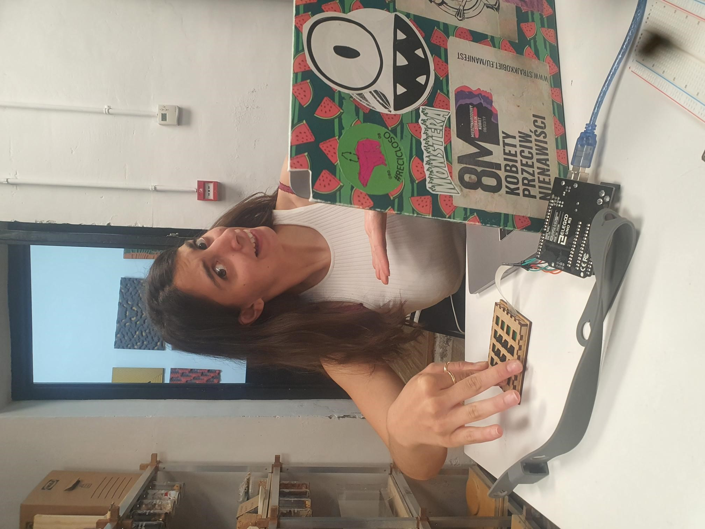
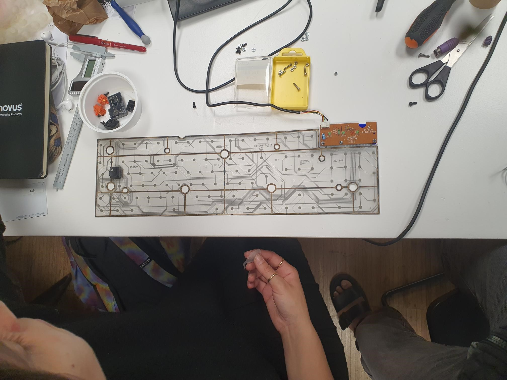
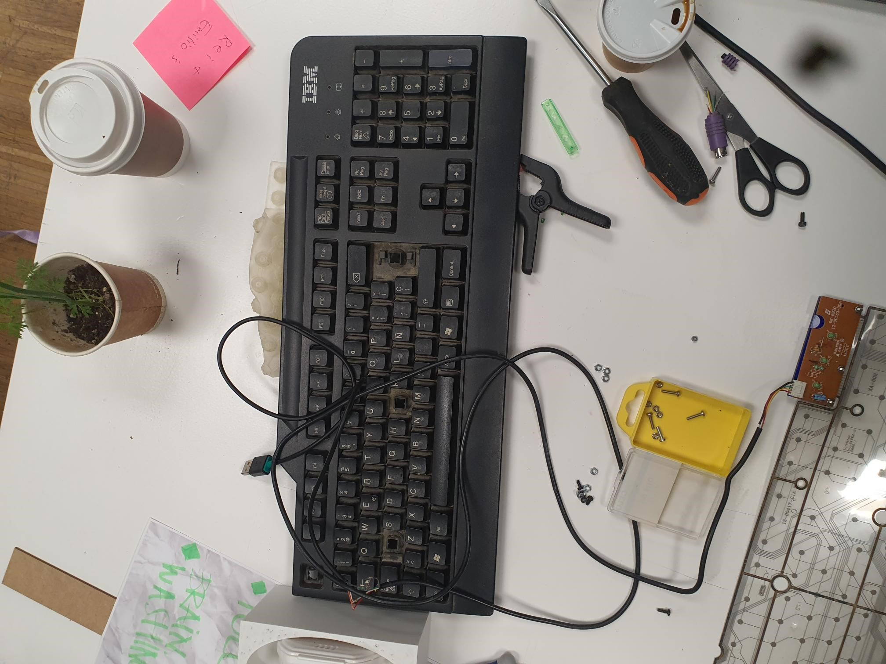

# Fab-Challenge-3 Meme Pad

##  Explain how it is linked to your research areas
THe goal of the third  Fabrication challenge was to make an ethical tool that allows us to interact with others. In terms of our research ideas and interests Busisiwe is interested in topics of AR, VR and alternative media,Accessibility in interactive technologies, intersections between human made and AI made artistic expressions in the virtual and also connections between the digital and physical landscapes. Andrea’s area of interests and research lies in material culture, trash landscapes, ethics behind the machine and tech, interface technologies and narratives behind the objects we use. In this we thought, how can we “hack” everyday objects, and modify them into props that question the current computer and mobile applications we used that are made by big tech. We aimed to explore how we can use protocols instead of services, calling to agency, and awareness to our current interfaces and ways of communicating.

## Initial idea / Concept of the Project ( What questions need to be answered?)
Our current ecosystems and networks of communication are mostly hosted on the services of big tech companies, where they use the patterns and habits online for their own interests and profits. At the same time, content making culture of the web2.0, has ushered in a new internet presence and culture where non-text communication is used and micro subgenres and aesthetics.  such as meme culture and emojis.

Keeping this in mind, our idea was to explore new means of interaction culture. Revisit nostalgic internet imagaries and appropriating them into a new interface, where the keypad artefact is used a tool for storytelling and expression within the imbedded meanings of meme culture. Our inspirations are from everyday objects, the nostalgic vaporwave movement, discord chatrooms and the beginnings of communication in web 1.0 - the birth era of ASCII Art.

## Propose (What is supposed to do or not to do)

The purpose of the meme pad is to press the keycaps, that have meme symbols, where a corresponding meme will be printed in the user interface. Each button should print a different meme. 
There should be one meme shown at a time, and when a button is pressed the previous output should be erased.

## Shown how your team planned and executed the project

## Interaction protocol used
For this assignment, we were tasked to use a networking communication tool. Our project uses serial communication. In the Arduino code, each keypad entry prints ASCII Art, which is then transmitted online into P5 using p5 Serial control that creates a serial server between arduino and p5.js  Additionally, we hosted the html website, which is the user interface of our project on github. Our goal was to eventually host 
two transmission lines to send and receive data, and that data is continuously sent and received one bit at a time.

## honest Design (use of technology in a meaningful way, in relation to the topics)
Our interpretation in making honest design decisions, was at first, using obsolescence tech instead of making or fabricating new artifacts. We were beginning to understand the obstacles, opportunities and 

## Creative Materials Used:
1. Gelatine powder 
2. Glycerin Soap
3. Wanted to “hack” keyboard instead of a keypad 

##  Creative Technologies used:
1. ASCII ART for memes
2. Exploring with emulating keyboards using P5.Js and javascript
3. Making our own website to host the interface

##  Explore design boundaries (based on your expertise)

We wanted to host the p5.js code, used by the p5 serial server, to eventually run a website that does not depend on the Arduino serial communication. Further development of the project would be to explore how to run the interface on a website that can be accessed by anyone not dependent on Arduino connection.
At first we wanted to repurpose and hack an old computer keyboard as an input device. The keyboard we hacked had a PS2 adapter, we tried to think how we could change the protocol of the old keyboard to be used in Arduino using a matrix. After rewiring the port to usb, and also connecting it to a breadboard, the keyboard membrane did not work, although all the electronic parts seemed like they were conductive. We decided to use a keypad membrane with a keypad.h Arduino library
We made keycaps for the keypad, for accessibility and texture. The keycaps were made from jelly powder glycerin soap, yet we did not account for the shrinking, so the keycap 3d model is not visible. We then 3D printed the keycaps as an alternative. 

## Listed future development opportunity for this project
1. Adding a website server for the application
2. Making buttons that are more softer
3. Further grow the repository of memes

## Fabrication Replicability: List of Components used 
1. Lazer cut Meme-BOX
2. Elegoo Uno / Arduino Uno
3. Jumper cables for Keypad
4. Keypad 
5. Downloaded libraries: Keypad.h and Keyboard.h 

